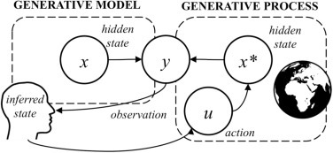
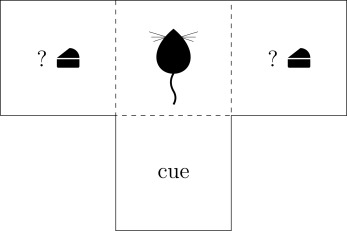

# DRL2025最終課題 : 能動的推論の実装と、RLとの関係性 

## はじめに
講義でControl as Inference(CAI) を学び、強化学習を推論として解釈する方法を知り興味を持った。一方、能動的推論もまた、エージェントが推論を行い環境と相互作用するアルゴリズムである。講義や演習で学んだ(D)RL、CaIと能動的推論がどう繋がるのか興味を持ち、今回のプロジェクトを立ち上げた。

## 内容(tmaze.ipynb)

1. pymdpパッケージのリポジトリ[A Python implementation of active inference for Markov Decision Processes](https://github.com/infer-actively/pymdp/tree/master)を参考に、離散時間における能動的推論を実装し、能動的推論への理解を深める。

(生成プロセスと生成モデル  画像 :  https://www.sciencedirect.com/science/article/pii/S0301051123002612)

(今回の環境(T-Maze)  画像 : https://www.sciencedirect.com/science/article/pii/S0022249625000227)

2. 講義の演習で扱ったRLアルゴリズム(今回はQ学習)を同じ環境で実装し、振る舞いの違いを調べる。

3. Control as Inferenceとの関係性、また深層AIFについて、論文を調査し理解を深める。

